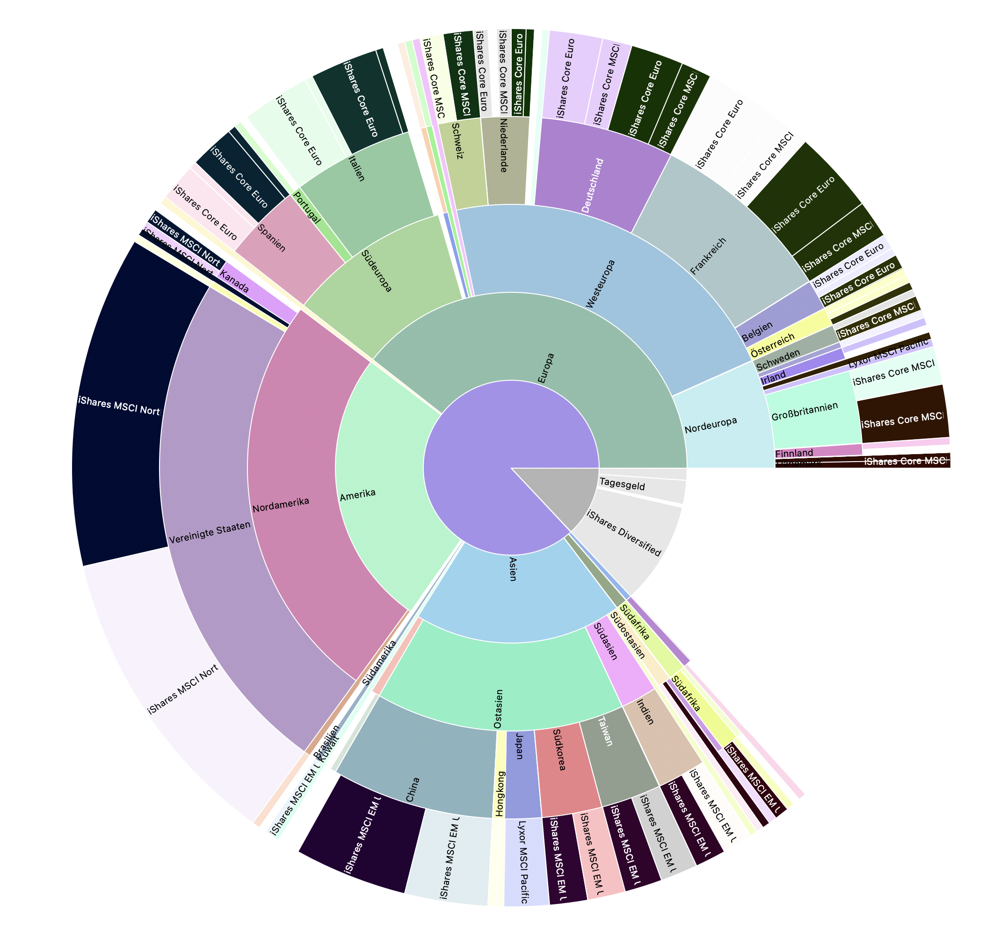
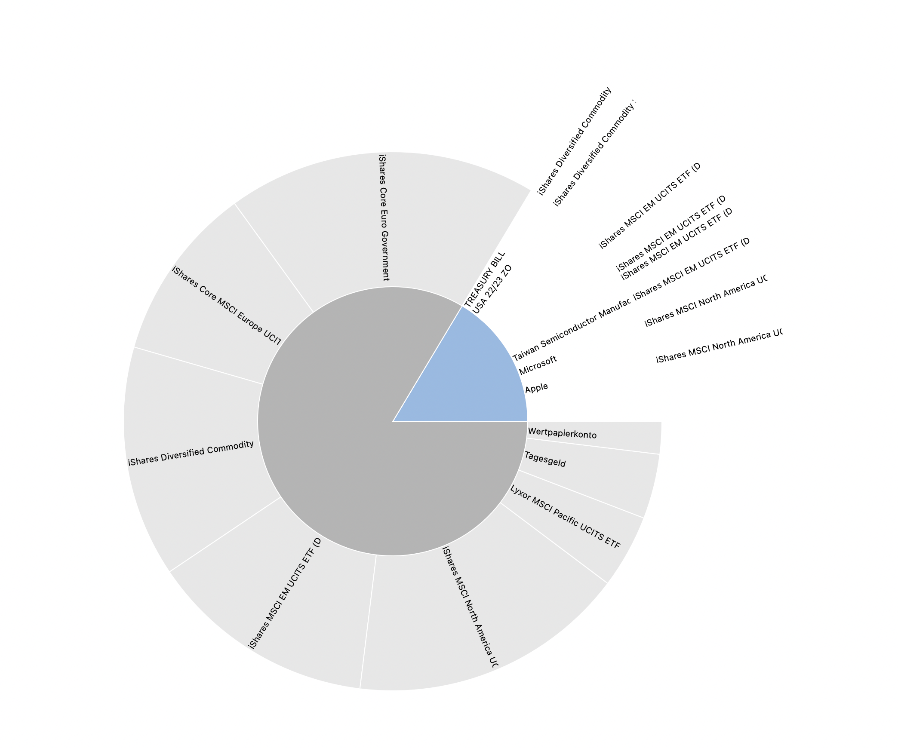
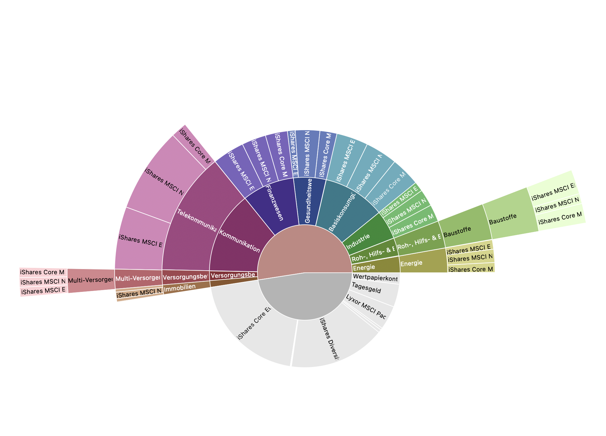

# Portfolio-Performance-ETF-and-Fond-Import

Additional tool to automatically import ETF and Fond data into classifications

> Both regions, industries and an own classification (top ten) are integrated into an existing portfolio performance
> .xml file with the help of this program. The data for this is loaded from onvista.de.

(PP = Portfolio Performance)

German below

**_Java required!_**

- Code is located in the `src` folder,

- Examples in the `portfolio_performance_file_example` folder.

|              Regionen              |              Top10              |
|:----------------------------------:|:-------------------------------:|
|   |   |

|                 Branchen (GICS)                  |
|:------------------------------------------------:|
|  |

## Explanation of classifications

### _regions_

- Shares of ETFs / funds in the respective regions

### _Industries (GICS)_

- ETFs / funds in the respective sectors

- However, there are deviations in the naming on the part of onvista and GICS.

- The program tries to determine the appropriate industry, this is in most cases also correct.

- With the text file `portfolio_performance_file/logs/{etf-or-fond-name}.txt` it is possible to track afterwards how the
  classification took place.

- In PP, adjustments can be made retrospectively.

### _Top Ten_

- Top 10 shares of all ETFs / funds.

- If there is no overlap of ETFs / funds, this classification is not necessary. (Is very rarely the case, e.g.: Apple is
  represented in the All World and NASDAQ. Top 10 shows exactly the share of Apple in the portfolio).

- Shows how much % of the portfolio the largest 10 positions make up.

> _Note:_ The name of the companies varies per ETF / fund (e.g. Apple and Apple Inc. and APPLE). Here you have to sort
> in PP afterwards to merge the ETF / Fund shares in one folder.

## How To

### **_First create a backup of the .xml file!_**

> The original file is not changed.

> A new file will be generated as output (portfolio performance ETF import).

### _Preparation_

1. create all necessary folders (follow the example folder)

    1. in the root folder create a folder named `portfolio_performance_file

    2. in the `portfolio_performance_file` folder create a folder with the name `logs

2. copy your PP-XML file into the folder `portfolio_performance_file`. (Don`t move your original file, otherwise you`ll
   be lost in case of an error).

3. name your file `Portfolio Performance.xml`.

### _Program start_

1. open the project in an IDE of your choice.

2. import the library `lib >> gson-2..9.0.jar` into the project. (In IntelliJ: Project Structure... >> Modules >>
   Dependencies >> + (Export checkbox ticked))

3. go to [Go to Main.java-file](src/Main.java)

4. run

At the first start it is normal that
the [Save file](portfolio_performance_file/logs/do_not_delete_needed_for_next_import) is not present and everything
should be imported.

This save file prevents duplicate entries from being created in later executions (however, a new entry will be shown
after rebalancing the ETF if the weighting of a sector has changed).

### _Use_

- Output file is "Portfolio Performance Import.xml" (portfolio_performance_file/Portfolio Performance Import.xml)

- Open the file in PP and check the data

    - Minor adjustments will still be necessary in Branches and Top Ten!

    - In the classifications right click on the main element -> color -> assign color randomly; (improves the
      overview/readability enormously.)

# German

> Sowohl Regionen, Branchen und eine eigene Klassifizierung (Top Ten) werden mithilfe dieses Programms in eine
> bestehende Portfolio Performance .xml Datei eingebunden. Die Daten dafür werden von onvista.de geladen.

- Code befindet sich im `src`-Ordner,
- Beispiele im `portfolio_performance_file_example`-Ordner.

## Erklärung der Klassifikationen

### _Regionen_

- Anteile der ETFs / Fonds in die jeweiligen Regionen

### _Branchen (GICS)_

- ETFs / Fonds in die jeweiligen Branchen
- Es gibt jedoch Abweichungen bei der Benamung seites onvista und GICS.
- Das Programm versucht die passende Branche zu ermitteln, dies ist in den meisten Fällen auch korrekt.
- Mit der Textdatei `portfolio_performance_file/logs/{etf-or-fond-name}.txt` lässt sich nachträglich nachverfolgen, wie
  die Einteilung stattgefunden hat.
- In PP kann nachträglich Anpassung vorgenommen werden.

### _Top Ten_

- Top 10 Aktien aller ETFs / Fonds.
- Gibt es keine Überschneidungen der ETFs / Fonds, ist diese Klassifikation nicht nötigt. (Ist sehr selten der Fall,
  bsp.: Apple ist im All World und NASDAQ vertreten. Top 10 zeigt exakt den Anteil von Apple im Portfolio)
- Zeigt, wie viel % des portfolios die größten 10 Positionen ausmachen.

> _Hinweis:_ Die Bezeichnung der Unternehmen variert pro ETF / Fond (z.B. Apple und Apple Inc. und APPLE). Hier muss
> nachträglich in PP sortiert werden, um die ETF / Fond Anteile in einem Ordner zusammen zuführen.

## How To

### **_Zunächst erstelle ein Backup der .xml Datei!_**

> Die ursprüngliche Datei nicht verändert.
> Als Output wird eine neue Datei generiert (Portfolio-Performance-ETF-Import)

### _Vorbereitung_

1. Erstelle alle notwendigen Ordner (Orientiere dich am example folder)
    1. Im Root-Ordner einen Ordner mit dem namen `portfolio_performance_file`
    2. Im `portfolio_performance_file`-Ordner einen Ordner mit dem namen `logs`
2. Kopiere deine PP-XML-Datei in den Ordner `portfolio_performance_file`. (Verschiebe deine Originaldatei nicht, sonst
   bist du aufgeschmissen im Fehlerfall!)
3. Bennene deine Datei `Portfolio Performance.xml`

### _Programmstart_

1. Öffne das Projekt in einer IDE deiner Wahl.
2. Importiere die Bibliothek `lib >> gson-2..9.0.jar` in das Project. (In IntelliJ: Project Structure... >> Modules >>
   Dependencies >> + (Export checkbox ticked))
3. Gehe zur [Gehe zur Main.java-file](src/Main.java)
4. Run
   Beim ersten Start ist es normal, dass
   die [Speicherungs Datei](portfolio_performance_file/logs/do_not_delete_needed_for_next_import) nicht vorhanden ist
   und alles importiert werden soll.
   Diese Speicherungs Datei verhindert bei späteren Ausführungen, dass doppelte Einträge angelegt werden (jedoch wird
   nach einem Rebalancing des ETF ein neuer Eintrag erzeigt, wenn die Gewichtung einer Branche sich verändert hat).

### _Verwendung_

- Output file is "Portfolio Performance Import.xml" (portfolio_performance_file/Portfolio Performance Import.xml)
- Öffne die Datei in PP und überprüfe die Daten
    - Kleinere Anpassungen werden dennoch in Branchen und Top Ten nötig sein!
    - In den Klassifizierungen auf das Hauptelement rechtsklicken -> Farbe -> Farbe zufällig zuweisen; (verbessert die
      Übersicht/lesbarkeit enorm.)

### Source

Updated version
from [Portfolio-Performance-ETF-Import](https://github.com/Wafffelmonster/Portfolio-Performance-ETF-Import)